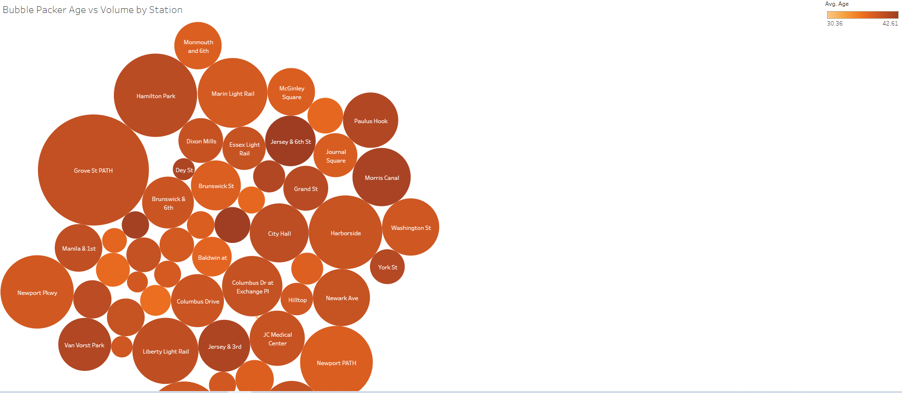

You can find my Tabluea-Public analysis at https://public.tableau.com/app/profile/geoffrey.pawlowski/viz/Citi-Bike_1999_twbx/VolumeYeartoYear

## Background - Hypothetical Scenario

Congratulations on your new job! As the new lead analyst for the [New York Citi Bike](https://en.wikipedia.org/wiki/Citi_Bike) Program, you are now responsible for overseeing the largest bike sharing program in the United States. In your new role, you will be expected to generate regular reports for city officials looking to publicize and improve the city program.

Since 2013, the Citi Bike Program has implemented a robust infrastructure for collecting data on the program's utilization. Through the team's efforts, each month bike data is collected, organized, and made public on the [Citi Bike Data](https://www.citibikenyc.com/system-data) webpage.

However, while the data has been regularly updated, the team has yet to implement a dashboard or sophisticated reporting process. City officials have a number of questions on the program, so your first task on the job is to build a set of data reports to provide the answers.

## Task

Use the data provided by the CitiBike API, and mine it for trends and nuggets of actionable intelligence!  

## Approach

I cleaned the data in Jupyter Notebooks using Python and then loaded the data in Tableau Public for visual inspection and analysis.  

Utilizng Tableau, I was able to find a number of insights and craft a "story" with the tool to bring to my theoretical bosses.  With the inights I was able to glean from visual inspecting the data I was able develop the following story, which is published on Tableau Public.  

Story pane #1 

	* From the pie chart we can see that females generated nearly 75% of bike trips in 2019
	
	* Females subscribers also outnumbered male subscribers 3 to 1
	
	* However, male and unknown customers (1 time users) equaled female identified customers in frequency of trips
	
	* The average age of our male and female users were roughly the same
	
	* Our customers who didn't identify themselves skewed much older than our other users, by 10-20 years
	
Story pane #2

	* Customers represent only a fraction of bike trips compared to subcribers
	
	* However, customer biking hours are 1/3 of total hours because the duration of their trips are significantly longer than subscribers
	
	* So, looking at these 2 dashboards, we can say that females do drive biking hours, but not as much as subscriber counts alone would have led us to believe
	
	* While customer ride counts are much lower than subscriber ride counts, they consume much more bike time than subscriber rides on a per ride basis.  
	
	* Based on story pane #1, we have a large segment of customers that we know skew older, who are renting our bicycles as one-offs that are generating a lot of bike hours
	
	* We would do well to find out more about this customer segment as they are likely a revenue generator and a segment that we would like to grow more.  

	* Another take away from this story is that we should focus on subscriber growth on the male segment of the population, given their lag to the female cohort.  

	
Story pane #3

	* The most popular stations have ridership that skews olders according to this bubble chart
	
	* This suggests that their is untapped potential with the younger demographic that we need to focus on if we want to expand our reach 
  
 
